# Chirin Ivatan — Entity Relationship Diagram

> Auto-generated from backend models. All PKs are UUID unless noted.

```mermaid
erDiagram

    %% ─────────────────────────────────────────
    %%  AUTH  (Django built-in)
    %% ─────────────────────────────────────────

    User {
        int      id PK
        string   username
        string   email
        string   first_name
        string   last_name
        bool     is_active
        bool     is_staff
        bool     is_superuser
        datetime date_joined
        datetime last_login
    }

    Group {
        int    id PK
        string name
    }

    User }o--o{ Group : "belongs to"

    %% ─────────────────────────────────────────
    %%  USERS APP
    %% ─────────────────────────────────────────

    UserProfile {
        uuid    id PK
        string  municipality
        string  post_nominals
        string  affiliation
        string  occupation
        json    cultural_affiliations
        json    other_affiliations
        text    bio
        bool    include_in_leaderboard
        bool    show_on_yaru_chart
        bool    show_live_contributions
        image   profile_photo
    }

    UserContributionStats {
        uuid     id PK
        int      combined_total
        int      dictionary_original_total
        int      folklore_original_total
        int      total_rejections
        int      review_completed_total
        int      dictionary_month
        int      folklore_month
        int      combined_month
        string   last_month_calculated
        int      contributor_level
        int      reviewer_level
        json     unlocked_badges
        datetime updated_at
    }

    ContributionEvent {
        uuid     id PK
        string   contribution_type
        datetime awarded_at
    }

    UserSessionEvent {
        uuid     id PK
        string   event_type
        string   ip_address
        string   user_agent
        datetime created_at
    }

    AdminAccountAction {
        uuid     id PK
        string   action
        string   role
        text     notes
        string   status_before
        string   status_after
        string   flag_status
        datetime resolved_at
        text     resolution_notes
        datetime created_at
    }

    RoleApplication {
        uuid     id PK
        string   target_role
        text     reviewer_reason
        string   status
        datetime created_at
        datetime updated_at
        datetime decided_at
    }

    RoleApplicationDecision {
        uuid     id PK
        string   decision
        text     notes
        datetime created_at
    }

    RoleOnboardingRecord {
        uuid     id PK
        string   role
        string   method
        text     accountability_notes
        datetime created_at
    }

    RoleInvitation {
        uuid     id PK
        uuid     token
        string   email
        string   role
        string   status
        string   first_name
        string   last_name
        string   municipality
        text     notes
        datetime expires_at
        datetime created_at
        datetime accepted_at
    }

    RecognitionEvent {
        uuid     id PK
        string   municipality
        string   event_type
        string   reference_id
        json     payload
        datetime created_at
    }

    GamificationConfig {
        string   name PK
        json     contributor_levels
        json     reviewer_levels
        json     dictionary_badges
        json     folklore_badges
        json     quality_badge
        datetime updated_at
    }

    GamificationRuntimeState {
        string   key PK
        string   last_winner_processed_month
        datetime updated_at
    }

    MunicipalityStats {
        string   municipality PK
        int      dictionary_all_time
        int      folklore_all_time
        int      combined_all_time
        int      dictionary_month
        int      folklore_month
        int      combined_month
        string   last_month_calculated
        datetime updated_at
    }

    MunicipalityMonthlyWinner {
        uuid     id PK
        string   month_key
        string   metric
        string   municipality
        int      score
        datetime created_at
    }

    SiteContentSettings {
        string   key PK
        string   brand_name
        string   brand_logo_url
        text     landing_intro_text
        text     landing_body_text
        json     about_intro_paragraphs
        json     about_body_paragraphs
        json     support_statements
        json     partner_details
        json     faq_sections
        json     privacy_notice_paragraphs
        json     contributor_agreement_paragraphs
        bool     maintenance_enabled
        text     maintenance_message
        datetime updated_at
    }

    %% ─────────────────────────────────────────
    %%  DICTIONARY APP
    %% ─────────────────────────────────────────

    VariantGroup {
        uuid     id PK
        datetime created_at
    }

    Entry {
        uuid     id PK
        bool     is_mother
        string   term
        string   part_of_speech
        string   pronunciation_text
        string   phonetic
        text     meaning
        text     usage_notes
        text     etymology
        text     example_sentence
        text     example_translation
        text     source_text
        bool     term_source_is_self_knowledge
        string   english_synonym
        string   ivatan_synonym
        string   english_antonym
        string   ivatan_antonym
        image    photo
        text     photo_source
        bool     photo_source_is_contributor_owned
        file     audio_pronunciation
        text     audio_source
        bool     audio_source_is_self_recorded
        string   variant_type
        json     inflected_forms
        string   status
        datetime last_approved_at
        datetime created_at
        datetime archived_at
    }

    EntryRevision {
        uuid     id PK
        json     proposed_data
        string   status
        text     reviewer_notes
        bool     is_base_snapshot
        datetime created_at
        datetime approved_at
    }

    %% ─────────────────────────────────────────
    %%  FOLKLORE APP
    %% ─────────────────────────────────────────

    FolkloreEntry {
        uuid     id PK
        string   title
        text     content
        string   category
        string   subcategory
        string   municipality_source
        text     source
        bool     self_knowledge
        string   media_url
        image    photo_upload
        file     audio_upload
        text     media_source
        bool     self_produced_media
        string   copyright_usage
        string   status
        datetime created_at
        datetime updated_at
        datetime archived_at
    }

    FolkloreRevision {
        uuid     id PK
        json     proposed_data
        image    photo_upload
        file     audio_upload
        string   status
        string   revision_type
        text     reviewer_notes
        bool     is_base_snapshot
        datetime created_at
        datetime approved_at
    }

    FolkloreComment {
        uuid     id PK
        text     body
        datetime created_at
    }

    %% ─────────────────────────────────────────
    %%  REVIEWS APP
    %% ─────────────────────────────────────────

    Review {
        uuid     id PK
        string   decision
        text     notes
        int      review_round
        datetime created_at
    }

    FolkloreReview {
        uuid     id PK
        string   decision
        text     notes
        int      review_round
        datetime created_at
    }

    ReviewAdminOverride {
        uuid     id PK
        string   target_type
        string   action
        text     notes
        string   status_before
        string   status_after
        datetime created_at
    }

    %% ═══════════════════════════════════════════
    %%  RELATIONSHIPS
    %% ═══════════════════════════════════════════

    %% — User ↔ profile & stats (1:1) —
    User ||--|| UserProfile                : "has profile"
    User ||--|| UserContributionStats      : "has stats"

    %% — User → activity logs —
    User ||--o{ ContributionEvent          : "earns"
    User ||--o{ UserSessionEvent           : "logs session"
    User ||--o{ RecognitionEvent           : "receives"

    %% — User → admin actions —
    User ||--o{ AdminAccountAction         : "is target of"
    User ||--o{ AdminAccountAction         : "performs (admin)"
    User ||--o{ AdminAccountAction         : "resolves flag"

    %% — User → role lifecycle —
    User ||--o{ RoleApplication            : "applies for"
    User ||--o{ RoleApplicationDecision    : "decides on"
    User ||--o{ RoleOnboardingRecord       : "is onboarded via"
    User }o--o{ RoleOnboardingRecord       : "approved by (reviewers M2M)"
    User }o--o{ RoleOnboardingRecord       : "approved by (admins M2M)"
    User ||--o{ RoleInvitation             : "sends"
    User ||--o{ RoleInvitation             : "accepts"

    %% — Role lifecycle internals —
    RoleApplication ||--o{ RoleApplicationDecision : "receives"
    RoleApplication |o--o{ RoleOnboardingRecord    : "sources"

    %% — Site config —
    User ||--o{ SiteContentSettings        : "last updated by"

    %% — User → dictionary contributions —
    User ||--o{ Entry                      : "initial contributor"
    User ||--o{ Entry                      : "last revised by"
    User }o--o{ Entry                      : "approved by (M2M)"
    User ||--o{ Entry                      : "audio contributor"
    User ||--o{ Entry                      : "photo contributor"
    User ||--o{ EntryRevision              : "submits"

    %% — User → folklore contributions —
    User ||--o{ FolkloreEntry              : "contributes"
    User ||--o{ FolkloreRevision           : "submits"

    %% — User → reviews —
    User ||--o{ Review                     : "reviews (dict)"
    User ||--o{ FolkloreReview             : "reviews (folklore)"
    User ||--o{ ReviewAdminOverride        : "overrides"

    %% — Dictionary structure —
    VariantGroup |o--|| Entry              : "mother entry"
    VariantGroup ||--o{ Entry              : "groups variants"
    Entry        ||--o{ EntryRevision      : "has revisions"

    %% — Folklore structure —
    FolkloreEntry ||--o{ FolkloreRevision  : "has revisions"
    FolkloreEntry |o--o{ FolkloreRevision  : "variant_of (source entry)"
    FolkloreEntry ||--o{ FolkloreComment   : "has comments"
    User ||--o{ FolkloreComment            : "authors"

    %% — Review workflows —
    EntryRevision   ||--o{ Review               : "reviewed via"
    FolkloreRevision ||--o{ FolkloreReview      : "reviewed via"

    %% — Admin overrides —
    ReviewAdminOverride |o--o| Entry            : "targets (dict)"
    ReviewAdminOverride |o--o| FolkloreEntry    : "targets (folklore)"

    %% — Contribution event cross-references —
    ContributionEvent |o--o| Entry              : "credits (dict term)"
    ContributionEvent |o--o| EntryRevision      : "credits (dict revision)"
    ContributionEvent |o--o| FolkloreEntry      : "credits (folklore)"
    ContributionEvent |o--o| FolkloreRevision   : "credits (folklore revision)"
```

---

## Entity Count

| App           | Entities                                                                                                                                                                                                                                                                                                       |
| ------------- | -------------------------------------------------------------------------------------------------------------------------------------------------------------------------------------------------------------------------------------------------------------------------------------------------------------- |
| Auth (Django) | User, Group                                                                                                                                                                                                                                                                                                    |
| users         | UserProfile, UserContributionStats, ContributionEvent, UserSessionEvent, AdminAccountAction, RoleApplication, RoleApplicationDecision, RoleOnboardingRecord, RoleInvitation, RecognitionEvent, GamificationConfig, GamificationRuntimeState, MunicipalityStats, MunicipalityMonthlyWinner, SiteContentSettings |
| dictionary    | VariantGroup, Entry, EntryRevision                                                                                                                                                                                                                                                                             |
| folklore      | FolkloreEntry, FolkloreRevision, FolkloreComment                                                                                                                                                                                                                                                               |
| reviews       | Review, FolkloreReview, ReviewAdminOverride                                                                                                                                                                                                                                                                    |
| **Total**     | **25 entities**                                                                                                                                                                                                                                                                                                |

---

## Key Design Notes

| Pattern                 | Detail                                                                                                                                                                                                                                                                                                                |
| ----------------------- | --------------------------------------------------------------------------------------------------------------------------------------------------------------------------------------------------------------------------------------------------------------------------------------------------------------------- |
| All PKs                 | UUID (`uuid.uuid4`) except `User` (int), `MunicipalityStats` (string), `GamificationConfig` (string), `GamificationRuntimeState` (string)                                                                                                                                                                             |
| Status lifecycle        | `draft → pending → approved / rejected`; published entries can enter `approved_under_review` or `archived`                                                                                                                                                                                                            |
| Revision model          | Both Dictionary and Folklore use a snapshot revision pattern — each `EntryRevision` / `FolkloreRevision` carries the full proposed state as JSON in `proposed_data`                                                                                                                                                   |
| Folklore revision types | `FolkloreRevision.revision_type` is `revision` (owner editing their own entry) or `variant` (alternate version by a different contributor). Variants have `entry=None` and `variant_of` pointing to the source `FolkloreEntry`; on approval `publish_revision` creates a new `FolkloreEntry` rather than overwriting. |
| Folklore ownership      | Only the original contributor (or admin/superuser) may revise a published `FolkloreEntry`. Any authenticated user may submit a variant. Reviewers may not revise entries they do not own.                                                                                                                             |
| Variant groups          | Dictionary entries can be grouped into `VariantGroup`s; one entry is the `mother` (canonical form), others are dialectal/orthographic variants                                                                                                                                                                        |
| Gamification            | Levels and badge thresholds live in `GamificationConfig` (JSON); unlocked badges are denormalised into `UserContributionStats.unlocked_badges` for fast reads                                                                                                                                                         |
| Leaderboard             | `MunicipalityStats` and `UserContributionStats` are pre-computed aggregates refreshed by background tasks; `MunicipalityMonthlyWinner` records the per-metric monthly champion                                                                                                                                        |
| Multi-approver          | `Entry.last_approved_by` is M2M — tracks every reviewer who approved the current revision                                                                                                                                                                                                                             |
| Role pipeline           | `RoleInvitation → RoleOnboardingRecord` (invite path) or `RoleApplication → RoleApplicationDecision → RoleOnboardingRecord` (application path)                                                                                                                                                                        |
| Audit trail             | `AdminAccountAction` logs every privileged account operation with before/after status snapshots and flag resolution tracking                                                                                                                                                                                          |
| Contribution credit     | `ContributionEvent` is the canonical credit ledger; four nullable FKs (to Entry, EntryRevision, FolkloreEntry, FolkloreRevision) with unique constraints prevent double-counting                                                                                                                                      |
