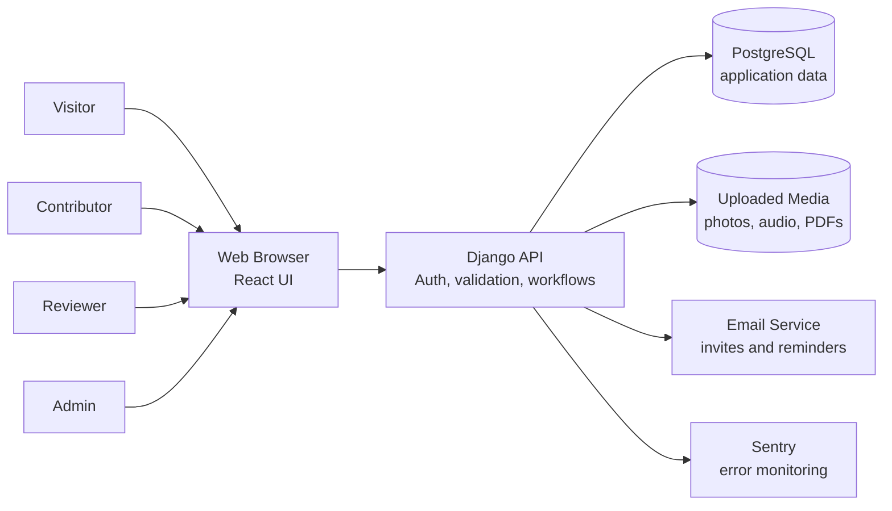
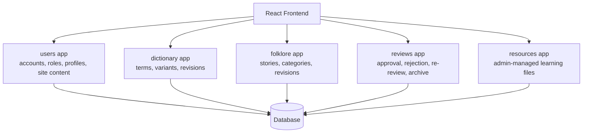
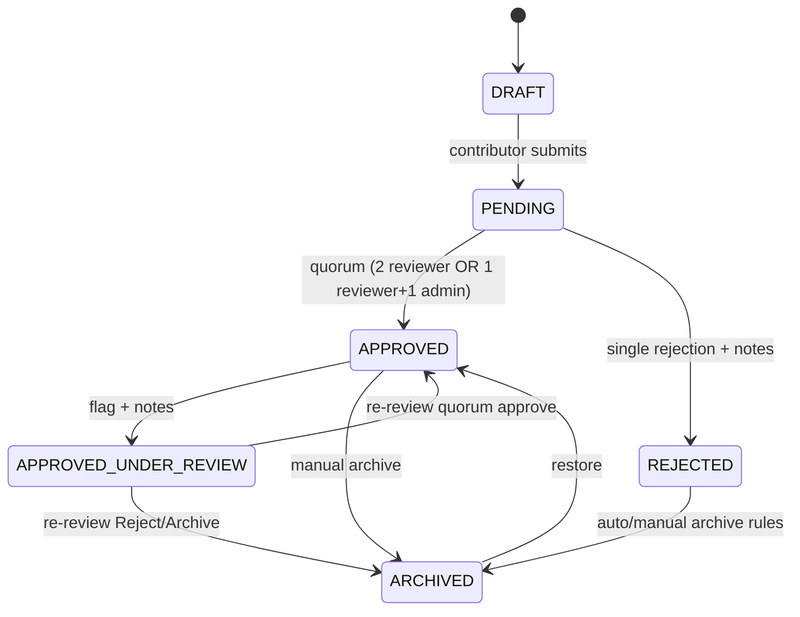
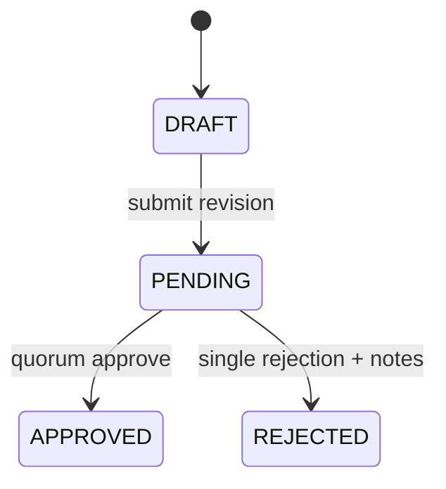
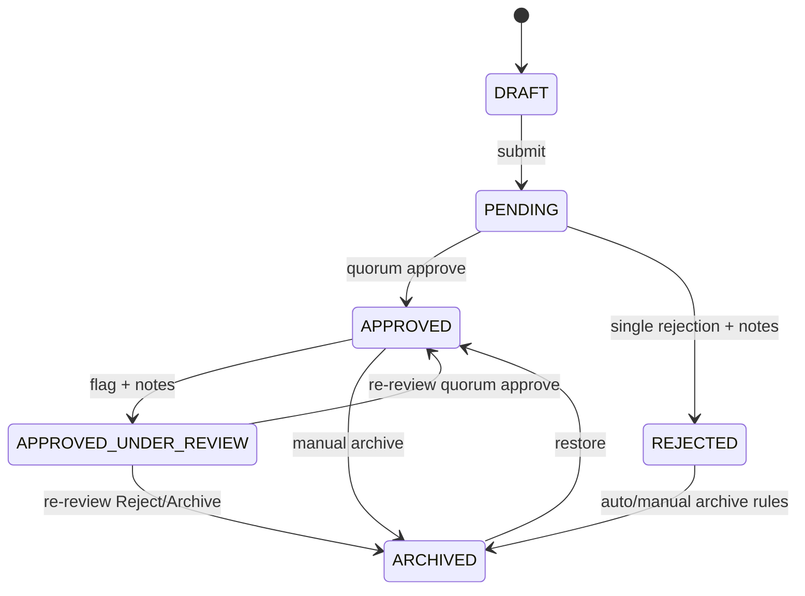
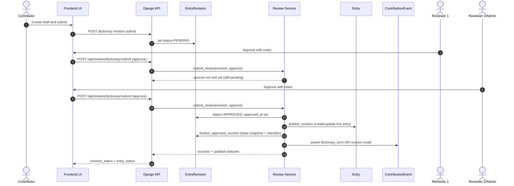
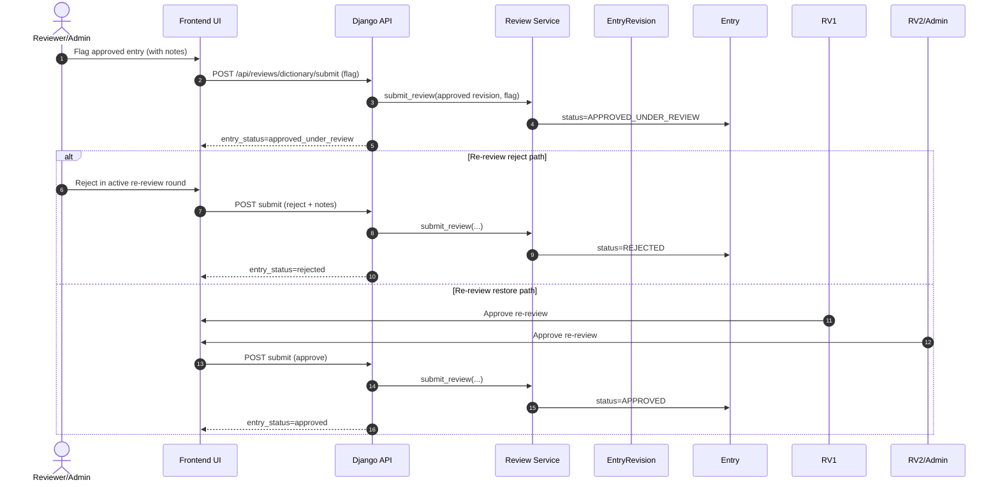
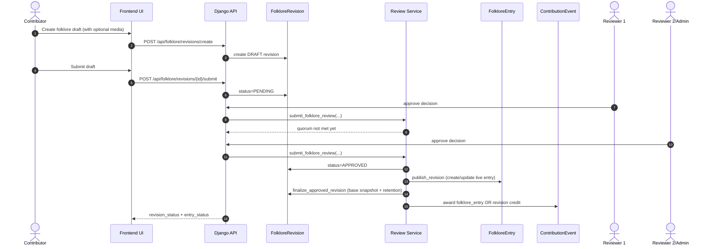

# SPEC-03 System Architecture Pack

Purpose: presentation-ready architecture visuals for project review, handoff,
and technical walkthroughs.

How to use this file:

- GitHub/Markdown viewers that support Mermaid can render these diagrams directly.
- You can also copy each Mermaid block into mermaid.live for export to PNG/SVG.
- Read Section 0 first if you need the short explanation before presenting the diagrams.
- For panel slides, use the diagrams as visuals and the short notes below each diagram as speaker notes.

---

## 0) Architecture At A Glance

Chirin Ivatan uses a standard web application architecture:

- **React frontend** renders public pages, contributor forms, reviewer queues, and admin tools.
- **Django backend** owns authentication, validation, review rules, publishing rules, and API responses.
- **PostgreSQL database** stores users, submissions, reviews, published entries, logs, and recognition data.
- **Uploaded media storage** keeps dictionary photos, pronunciation audio, folklore photos, and folklore audio outside the code repository.
- **Nginx + Gunicorn** serve the production application.
- **Sentry and CI checks** support production monitoring and release safety.

Important design idea:

> The frontend can collect and preview data, but the backend is the source of truth for validation, review decisions, publishing, permissions, and contribution credit.

### 0.1 System Context Diagram

How to read it:

- Users only interact with the browser.
- The browser talks to the Django API.
- The API writes to the database and media storage.
- Email and monitoring are supporting services, not the main source of data.

### 0.2 Main Backend Modules

The modules are separated by responsibility, but they work together. For example,
a dictionary submission is stored by the `dictionary` app, reviewed through the
`reviews` app, credited through user contribution records, and shown in the React
frontend after approval.

---

## 1) System ERD (Core Domain + Governance + Recognition)

This ERD is a simplified system view of the full data model. It focuses on the
tables that explain the main capstone logic: people, dictionary entries,
folklore entries, review governance, role onboarding, and recognition.

Reading guide:

- `USER` is the account at the center of most actions.
- `ENTRY` is a published or in-progress dictionary term.
- `ENTRY_REVISION` is the submitted snapshot that reviewers approve or reject.
- `FOLKLORE_ENTRY` and `FOLKLORE_REVISION` mirror the same pattern for folklore.
- `REVIEW` and `FOLKLORE_REVIEW` store reviewer decisions.
- `CONTRIBUTION_EVENT` is the credit ledger for badges, levels, and leaderboards.
- Role application tables keep account approval and onboarding auditable.

```mermaid
erDiagram
    USER ||--o| USER_PROFILE : has

    VARIANT_GROUP ||--o{ ENTRY : contains
    VARIANT_GROUP o|--|| ENTRY : mother_entry

    USER ||--o{ ENTRY : initial_contributor
    USER ||--o{ ENTRY : last_revised_by
    USER ||--o{ ENTRY : audio_contributor
    USER ||--o{ ENTRY : photo_contributor

    ENTRY ||--o{ ENTRY_REVISION : has
    USER ||--o{ ENTRY_REVISION : contributes

    ENTRY_REVISION ||--o{ REVIEW : reviewed_by_round
    USER ||--o{ REVIEW : reviewer

    FOLKLORE_ENTRY ||--o{ FOLKLORE_REVISION : has
    USER ||--o{ FOLKLORE_ENTRY : contributor
    USER ||--o{ FOLKLORE_REVISION : contributes
    FOLKLORE_REVISION ||--o{ FOLKLORE_REVIEW : reviewed_by_round
    USER ||--o{ FOLKLORE_REVIEW : reviewer

    USER ||--o{ CONTRIBUTION_EVENT : earns
    ENTRY o|--o{ CONTRIBUTION_EVENT : dictionary_entry
    FOLKLORE_ENTRY o|--o{ CONTRIBUTION_EVENT : folklore_entry
    ENTRY_REVISION o|--o{ CONTRIBUTION_EVENT : entry_revision
    FOLKLORE_REVISION o|--o{ CONTRIBUTION_EVENT : folklore_revision

    USER ||--o{ ROLE_APPLICATION : applicant
    ROLE_APPLICATION ||--o{ ROLE_APPLICATION_DECISION : has_decisions
    USER ||--o{ ROLE_APPLICATION_DECISION : decided_by
    USER ||--o{ ROLE_ONBOARDING_RECORD : onboarded_user
    USER o|--o{ ROLE_ONBOARDING_RECORD : invited_by
    ROLE_APPLICATION o|--o{ ROLE_ONBOARDING_RECORD : source_application

    USER ||--o| USER_CONTRIBUTION_STATS : cached_stats
    MUNICIPALITY_STATS {
      string municipality PK
    }

    USER o|--o{ RECOGNITION_EVENT : user_event

    GAMIFICATION_CONFIG {
      string name PK
    }

    GAMIFICATION_RUNTIME_STATE {
      string key PK
    }

    MUNICIPALITY_MONTHLY_WINNER {
      string month_key
      string metric
      string municipality
    }

    USER {
      uuid id PK
      string username
    }

    USER_PROFILE {
      int id PK
      string municipality
      string affiliation
      string occupation
      string bio
      string profile_photo
    }

    ENTRY {
      uuid id PK
      string term
      string status
      bool is_mother
      datetime archived_at
      datetime last_approved_at
    }

    VARIANT_GROUP {
      uuid id PK
      datetime created_at
    }

    ENTRY_REVISION {
      uuid id PK
      string status
      bool is_base_snapshot
      json proposed_data
      datetime approved_at
      datetime created_at
    }

    REVIEW {
      uuid id PK
      string decision
      int review_round
      text notes
      datetime created_at
    }

    FOLKLORE_ENTRY {
      uuid id PK
      string title
      string category
      string municipality_source
      string status
      string copyright_usage
      datetime archived_at
    }

    FOLKLORE_REVISION {
      uuid id PK
      string status
      bool is_base_snapshot
      json proposed_data
      datetime approved_at
      datetime created_at
    }

    FOLKLORE_REVIEW {
      uuid id PK
      string decision
      int review_round
      text notes
      datetime created_at
    }

    CONTRIBUTION_EVENT {
      uuid id PK
      string contribution_type
      datetime awarded_at
    }

    ROLE_APPLICATION {
      uuid id PK
      string target_role
      string status
      datetime created_at
      datetime decided_at
    }

    ROLE_APPLICATION_DECISION {
      uuid id PK
      string decision
      text notes
      datetime created_at
    }

    ROLE_ONBOARDING_RECORD {
      uuid id PK
      string role
      string method
      text accountability_notes
      datetime created_at
    }

    USER_CONTRIBUTION_STATS {
      int id PK
      int combined_total
      int dictionary_original_total
      int folklore_original_total
      int review_completed_total
      int contributor_level
      int reviewer_level
      json unlocked_badges
    }

    MUNICIPALITY_STATS {
      int dictionary_all_time
      int folklore_all_time
      int combined_all_time
      int dictionary_month
      int folklore_month
      int combined_month
      string last_month_calculated
    }

    RECOGNITION_EVENT {
      uuid id PK
      string event_type
      string municipality
      string reference_id
      json payload
      datetime created_at
    }
```

---

## 2) State Transition Diagrams

## 2.1 Dictionary Entry State Machine

## 2.2 Dictionary Revision State Machine

## 2.3 Folklore Entry State Machine

Notes:

- `DRAFT` means the contributor can still edit before submission.
- `PENDING` means reviewers/admins can act on the submission.
- `APPROVED` means the content can appear publicly.
- `APPROVED_UNDER_REVIEW` means a published entry was flagged but not yet removed.
- `ARCHIVED` means hidden from normal public use but still preserved.
- Permanent deletion is not part of the normal content lifecycle.

## 2.4 Folklore Revision State Machine

---

## 3) Sequence Diagrams

Sequence diagrams show time from top to bottom. They explain what happens after
a user clicks a button. In this system, the important pattern is:

1. the user acts in the frontend;
2. the frontend calls a Django API endpoint;
3. the backend updates a revision, review, entry, or contribution record;
4. the frontend receives the new status and updates the screen.

## 3.1 Dictionary Submit + Initial Review + Publish

## 3.2 Dictionary Post-Publish Re-Review (Flag -> Decision)

## 3.3 Folklore Submit + Review + Publish

---

## 4) Presentation Notes

Use 4 slides:

1. ERD slide (Section 1)
2. State machines slide (Section 2)
3. Dictionary sequence slide (Section 3.1 + 3.2)
4. Folklore sequence slide (Section 3.3)

Key message to panel:

- "All changes are revision-first and governance-validated before publication."
- "Auditability and accountability are first-class, not afterthoughts."
- "Contribution and recognition are backend-authoritative and non-inflationary."
- "Archived cultural records are preserved by default instead of being treated as disposable content."
